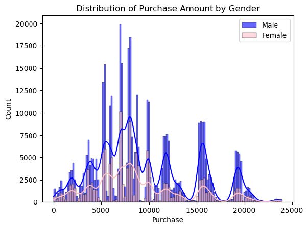
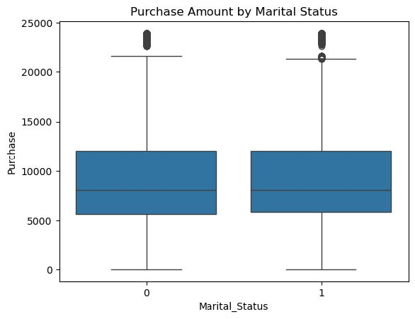

# Walmart Statistical Analysis

## Project Overview

This project analyzes Walmart Black Friday customer purchase behavior using statistical analysis, exploratory data analysis (EDA), confidence intervals, and the Central Limit Theorem (CLT).

The analysis focuses on customer spending patterns across gender, marital status, and age groups to derive business insights and support data-driven decision-making.

---

# Business Problem

Walmart wants to understand customer purchase behavior during Black Friday sales events and determine:

- Whether male and female customers spend differently
- Spending differences across marital status
- Spending behavior across age groups
- Population spending estimates using confidence intervals

These insights can help Walmart improve customer targeting, promotions, and sales strategy optimization.

---

# Analysis Performed

- Exploratory Data Analysis (EDA)
- Missing Value Detection
- Outlier Analysis
- Gender-wise Purchase Analysis
- Confidence Interval Estimation
- Central Limit Theorem (CLT)
- Marital Status Analysis
- Age Group Analysis
- Statistical Inference

---

# Statistical Concepts Used

This project demonstrates practical implementation of:

- Central Limit Theorem (CLT)
- Confidence Intervals
- Statistical Inference
- Sampling Distribution
- Outlier Detection
- Exploratory Data Analysis (EDA)
- Demographic-based Behavioral Analysis
# Sample Analysis Visualizations

## Gender-wise Purchase Distribution



---

## Marital Status Purchase Analysis



---

## Confidence Interval Analysis


# Tech Stack

- Python
- Pandas
- NumPy
- Seaborn
- Matplotlib
- SciPy
- Statistical Analysis

---
# Project Structure

```bash
Walmart-Statistical-Analysis/
│
├── README.md
├── Main_Analysis.py
├── Business_Insights.md
├── notebooks/
├── screenshots/
├── visualizations/
├── results/
├── datasets/
└── requirements.txt
```


# Project Status

🚧 Repository currently being rebuilt into a production-style statistical analytics portfolio project.
