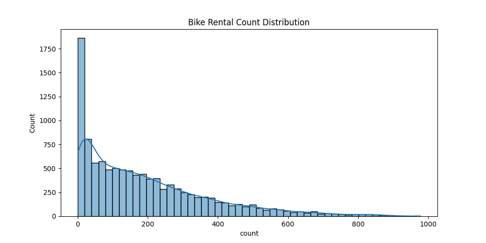
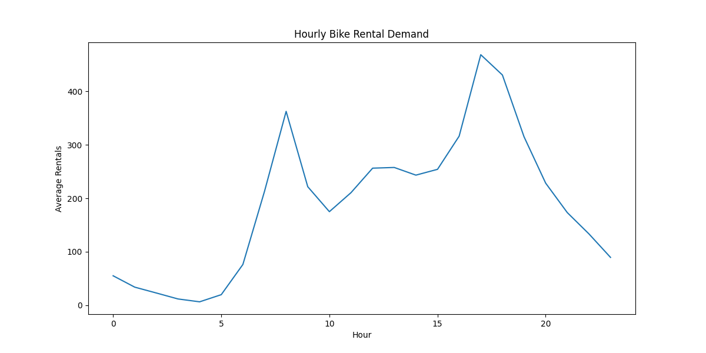
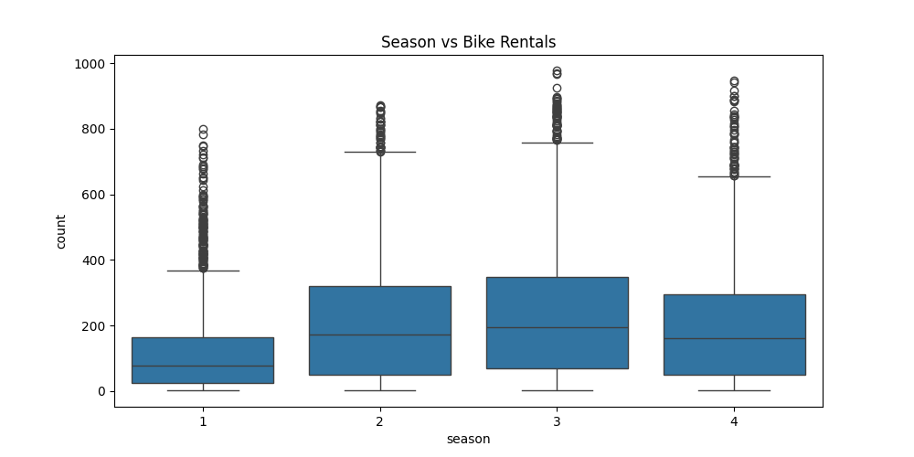
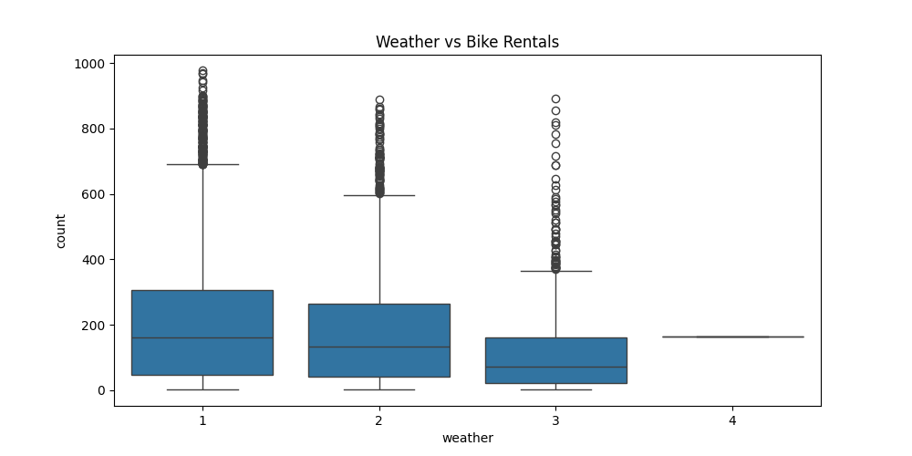
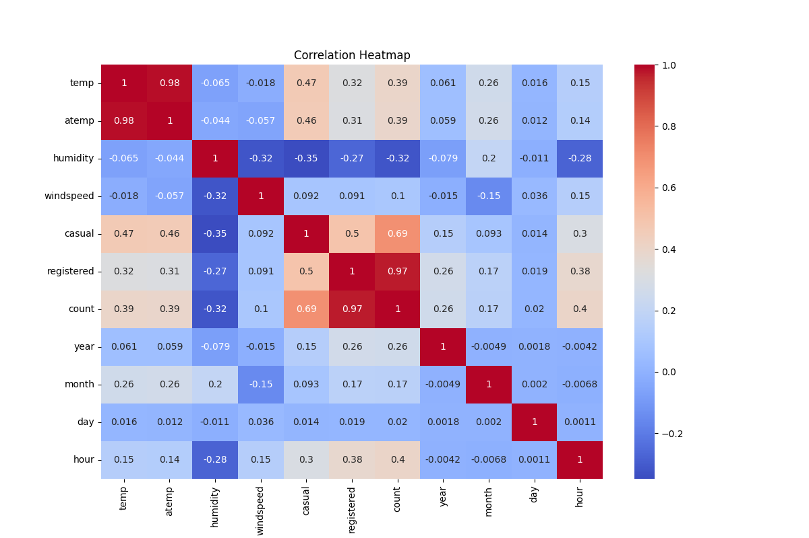

# Yulu Hypothesis Testing & Demand Analysis

Production-style statistical analytics project focused on understanding the factors affecting electric cycle rental demand for Yulu, India’s leading micro-mobility platform.

The project applies exploratory data analysis, statistical hypothesis testing, and business analytics techniques to identify the operational and environmental variables influencing customer rental behavior.

---

# Business Problem

Yulu has experienced fluctuations in electric cycle demand across different seasons, weather conditions, and working periods.

The company aims to understand the major factors affecting bike rental activity in order to:

* improve operational planning
* optimize fleet allocation
* understand customer demand behavior
* analyze seasonal demand fluctuations
* evaluate weather-driven rental impact
* support data-driven business decisions

---

# Project Objectives

This analysis focuses on:

* identifying statistically significant demand drivers
* understanding customer rental patterns
* evaluating weather and seasonal influence
* performing hypothesis testing on operational variables
* deriving business-oriented analytical insights
* building a production-style statistical analytics workflow

---

# Core Analysis Performed

## Exploratory Data Analysis (EDA)

* Univariate Analysis
* Bivariate Analysis
* Distribution Analysis
* Correlation Analysis
* Demand Trend Analysis

---

## Statistical Analysis

* Hypothesis Testing
* 2-Sample T-Test
* ANOVA Testing
* Chi-Square Testing
* Statistical Inference

---

## Operational Analytics

* Hourly Demand Analysis
* Seasonal Rental Trends
* Weather Impact Analysis
* Working Day Demand Analysis
* Rental Distribution Analysis

---

# Statistical Tests Used

## 2-Sample T-Test

Used to evaluate whether working days significantly impact bike rental demand.

---

## ANOVA Test

Used to determine whether bike rentals significantly vary across:

* seasons
* weather conditions

---

## Chi-Square Test

Used to identify dependency between:

* season
* weather conditions

---

# Key Business Insights

* Working days significantly influence bike rental demand.
* Seasonal fluctuations strongly impact customer usage patterns.
* Weather conditions directly affect electric cycle rentals.
* Peak demand occurs during office commuting hours.
* Poor weather conditions reduce overall rental activity.
* Demand patterns can support operational fleet optimization.

---

# Tech Stack

## Programming & Analytics

* Python
* Pandas
* NumPy

---

## Visualization

* Matplotlib
* Seaborn

---

## Statistical Analysis

* SciPy
* Statsmodels

---

# Project Structure

```bash
Yulu-Hypothesis-Testing/
│
├── README.md
├── datasets/
├── screenshots/
├── src/
│   └── Main_Pipeline.py
├── results/
├── visualizations/
└── requirements.txt
```

---

# Sample Visualizations

## Bike Rental Distribution



---

## Hourly Bike Rental Demand



---

## Season vs Bike Rentals



---

## Weather vs Bike Rentals



---

## Correlation Heatmap



---

# Repository Goals

This repository focuses on building:

* production-style analytics workflows
* statistically rigorous business analysis
* reproducible data analysis pipelines
* visualization-driven insights
* operational analytics systems

---

# Project Status

Completed production-style hypothesis testing and demand analytics implementation with automated visualization generation and statistical inference workflows.
